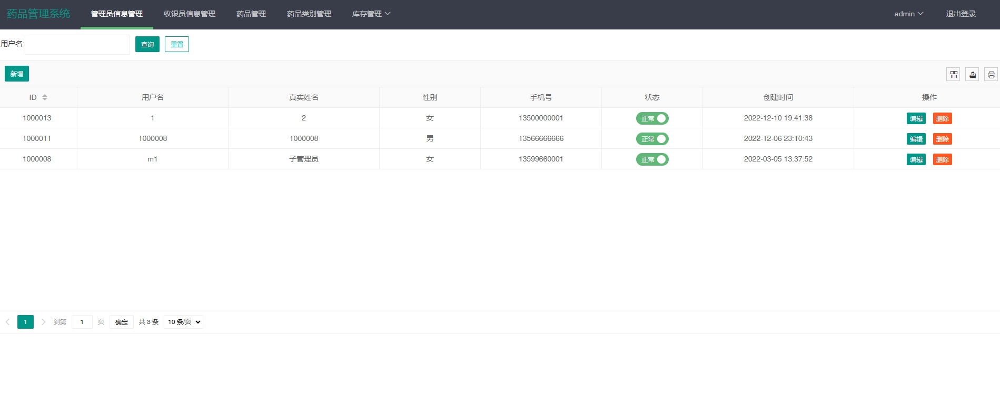
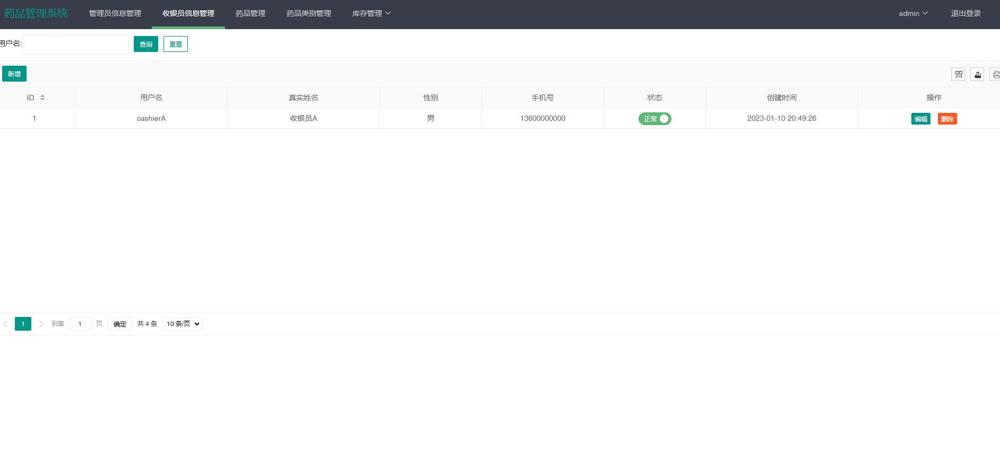
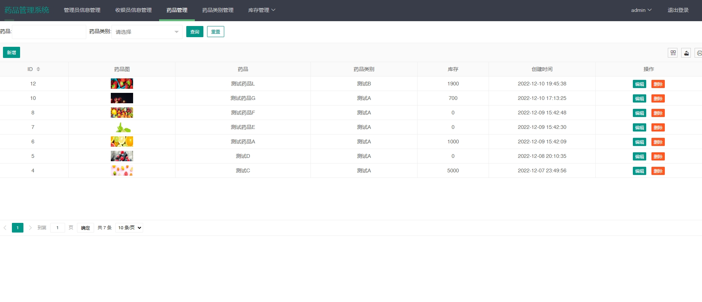
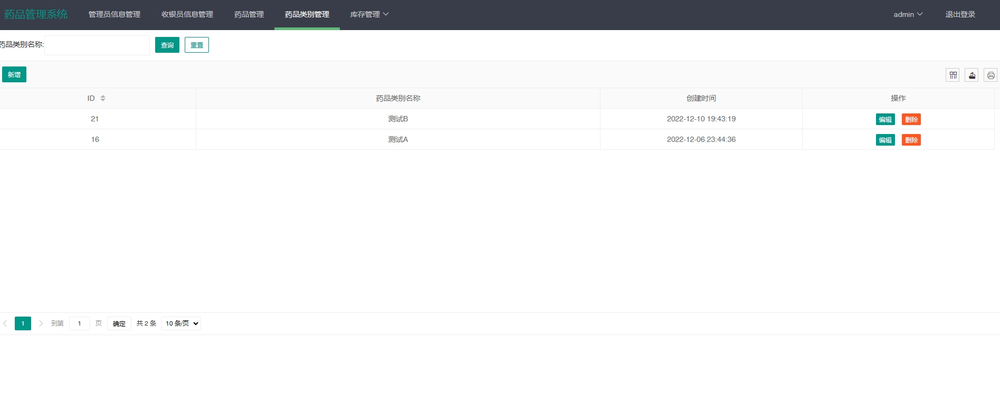
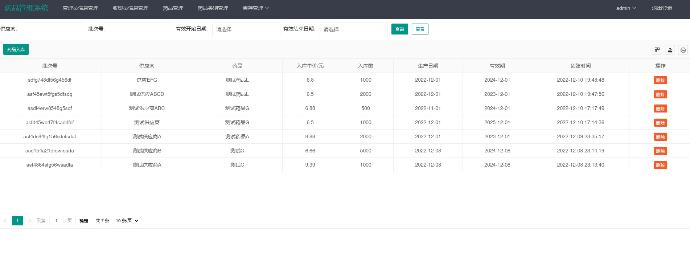
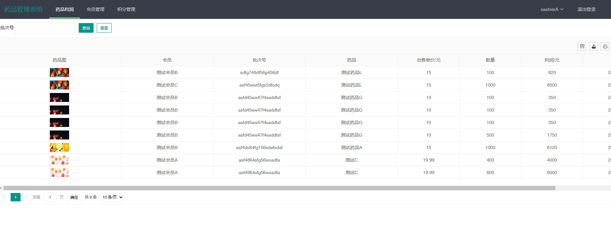
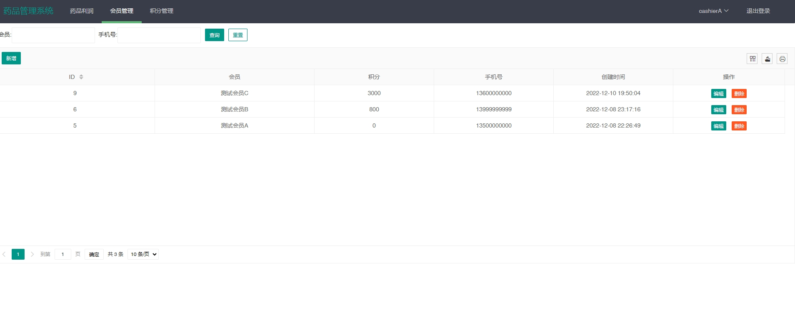
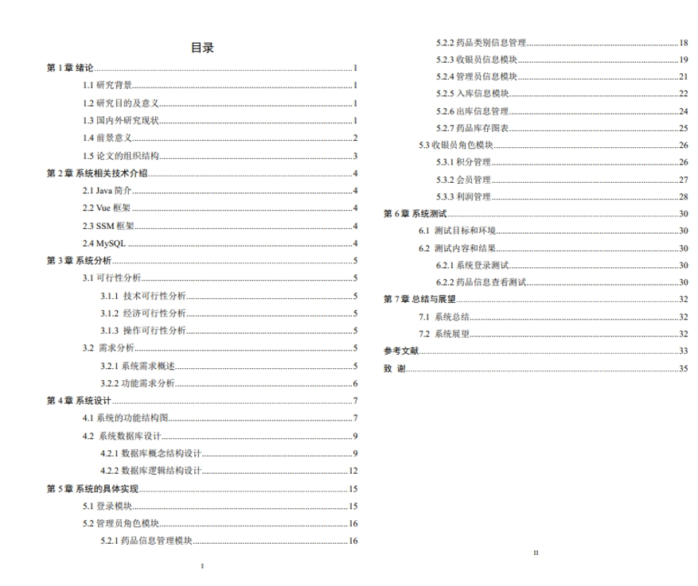

# 1.项目介绍
- 系统角色：管理员、收银员
- 功能模块：管理员（收银员信息管理、药品管理、药品类别、出库信息管理、入口信息。药品库存图表）、收银员（药品库存图表、会员积分信息等）
- 技术选型：SpringBoot、 layui等
- 测试环境：idea2024，MySQL5.7，jdk1.8，Maven3
# 2.项目部署
- 创建数据库，并导入sql
- 通过idea打开项目，根据本地数据库环境配置src/main/resources/application.yml  15-18行，很重要！！
- 运行项目
- 访问：http://localhost:8080/index.jsp  管理员账号密码 admin/123
# 3.项目部分截图

# 4.获取方式
[戳我查看](https://gitee.com/aven999/mall)